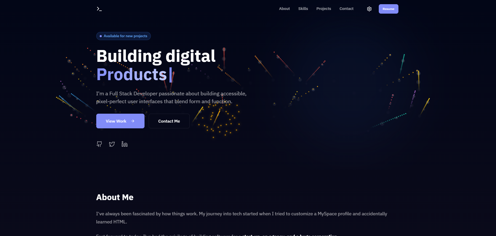

# Professional Developer Portfolio

A high-performance, interactive, and fully responsive portfolio website built with modern React. This project demonstrates advanced front-end techniques including dynamic background effects, real-time styling, multi-language support, and a unified design system.



## ✨ Key Features

### 🎨 Visuals & UI/UX
-   **"UI/UX Pro Max" Design**: A premium, motion-driven design philosophy focusing on micro-interactions, glassmorphism, and fluid animations to create a "wow" factor.
-   **Dynamic Backgrounds**: Six configurable background effects with real-time settings:
    -   🎨 **Color Drip**: Animated vertical gradient drips.
    -   ⭐️ **Meteor Shower**: Shooting stars with adjustable trails.
    -   ❄️ **Snowfall**: Atmospheric winter effect.
    -   ✨ **Fireworks**: Interactive fireworks with auto-fire and text support.
    -   ⚡️ **Gradient Wash**: Smooth, flowing color gradients.
    -   ◻️ **Solid Color**: Minimalist backing.
-   **Advanced Notification System**: Customizable toast notifications with:
    -   📍 **Position Control**: Matrix-style selection for all screen corners.
    -   🎨 **Visual Themes**: Choose between Default, Simple (Interactive Card), or Vibrant styles.
-   **Theme System**: Fully supported Dark & Light modes with smooth transitions.

### ⚙️ Technical Highlights
-   **Advanced Settings Portal**: A custom-built, multi-level settings modal allowing users to deeply customize their experience (animations, extensive background controls).
-   **Multi-Language Support (i18n)**: Full localization for English (EN), Vietnamese (VI), Japanese (JP), and Chinese (ZH).
-   **GitHub Integration**: Dynamically fetches and displays repositories using the GitHub API with caching and rate limit handling.
-   **Immersive Hero Section**: Features a full-height landing with typewriter effects and interactive "Discover More" scroll guidance.
-   **Responsive Layouts**: Pixel-perfect grid and list views that adapt to any device size.

## 🛠️ Tech Stack & Resources

This project leverages a curated stack of modern web technologies:

### Core Frameworks
-   **React 18**: Component-based UI architecture.
-   **Vite**: Next-generation frontend tooling for lightning-fast builds.

### Styling & Design
-   **Styled Components**: CSS-in-JS for modular, dynamic styling.
-   **Lucide React**: Beautiful, consistent icon set.
-   **UI/UX Pro Max**: Custom design methodology used for layout structure, spacing, and interaction patterns.

### State & Logic
-   **i18next**: Enterprise-grade internationalization framework.
-   **Context API**: State management for Themes, Settings, and Background configurations.

## 🚀 Getting Started

1.  **Clone the repository**
    ```bash
    git clone https://github.com/yourusername/portfolio.git
    ```

2.  **Install dependencies**
    ```bash
    npm install
    ```

3.  **Run the development server**
    ```bash
    npm run dev
    ```

## 📂 Project Structure

```
src/
├── components/         # Reusable UI components
│   ├── backgrounds/    # Logic for all background effects
│   ├── sections/       # Page sections (Hero, Projects, Contact)
│   ├── settings/       # Settings modal and configuration
│   └── ui/             # Atomic UI elements (Buttons, Modals)
├── context/            # Global state (Theme, Background, Settings)
├── i18n/               # Localization files (locales for EN, VI, JP, ZH)
└── styles/             # Global styles and theme tokens
```

## 📝 License

This project is open-source and available under the [MIT License](LICENSE).
